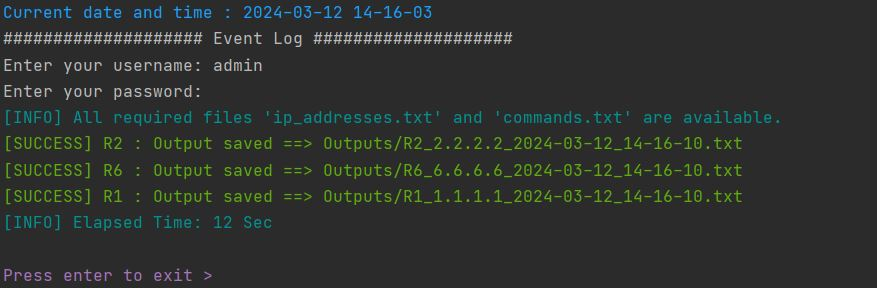

# Network Device Command Execution Script

This Python script allows users to execute commands on multiple network devices simultaneously via SSH. It's particularly useful for network administrators or engineers who need to perform routine tasks or configurations across a fleet of devices.

## Features

- **Parallel Execution:** Utilizes concurrent execution to speed up command execution across multiple devices (~4min on 230 7750SR routers).
- **Error Handling:** Handles various SSH-related errors such as timeout, authentication failure, and SSH issues gracefully.
- **Output Logging:** Saves command outputs to separate files for each device, facilitating troubleshooting and analysis.
- **Input Validation:** Checks for the existence of required input files (`IPAddressList.txt` and `commands.txt`) before execution.
- **Customizable:** Users can specify their own list of commands to execute on devices.

## Prerequisites

- Python 3.x
- Netmiko library (`pip install netmiko`)
- Colorama library (`pip install colorama`)

## Usage

1. Clone this repository to your local machine:

    ```bash
    git clone https://github.com/imadrouass/network-device-command-execution.git
    ```

2. Navigate to the project directory:

    ```bash
    cd network-device-command-execution
    ```

3. Install dependencies:

    ```bash
    pip install -r requirements.txt
    ```

4. Prepare input files:

   - Create a file named `IPAddressList.txt` containing the IP addresses of the target devices, with one IP address per line.
   - Create a file named `commands.txt` containing the commands you want to execute on the devices, with one command per line.

5. Run the script:

    ```bash
    python network_device_command_execution.py
    ```

6. Enter your username and password when prompted.

7. Monitor the script's output as it executes commands on the specified devices.

8. Once the script completes execution, check the `Outputs` folder for command outputs and the `LOGs` folder for error logs.

## Sample Result

Here's a sample screenshot showing the output of the script after successfully executing commands on multiple devices:



## Contributing

Contributions are welcome! If you have any suggestions, feature requests, or bug reports, please open an issue or create a pull request.

## License

This project is licensed under the MIT License - see the [LICENSE](LICENSE) file for details.

## Acknowledgements

- This script utilizes the [Netmiko](https://github.com/ktbyers/netmiko) library for SSH connectivity.
- Special thanks to the contributors of the Netmiko library for their efforts in making network automation easier.

